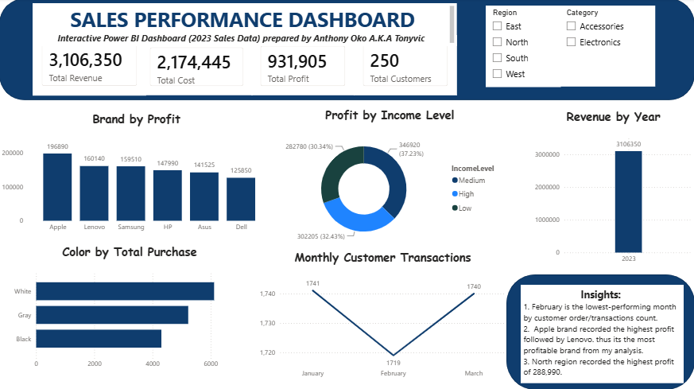

# Sales Performance Analysis Dashboard – Power BI

## Project Overview

This project was completed as part of my Data Analytics training with TS Academy.

The objective was to analyze sales performance using Power BI, develop key performance indicators (KPIs), identify business trends, and create an interactive dashboard for decision-making.

## Dataset

The dataset consists of three main tables:

- Customers
- Products
- Sales

The analysis covers sales data for 2023.

## Data Preparation

The dataset was reviewed and cleaned in Power Query before analysis.

Key preparation activities included:

- Removing unnecessary blank/null records from the dimension tables.
- Checking data types.
- Preparing date fields for analysis.
- Reviewing the Customers, Products and Sales tables.
- Establishing relationships between the tables.

## Data Model

The Power BI model consists of:

- Customers
- Products
- Sales

The Sales table serves as the central transaction table, connected to the Customers and Products tables through their respective IDs.

## Key Performance Indicators

The dashboard contains four major KPIs:

| KPI | Result |
|---|---:|
| Total Revenue | ₦3,106,350 |
| Total Cost | ₦2,174,445 |
| Total Profit | ₦931,905 |
| Total Customers | 250 |

## Analysis Performed

The dashboard provides analysis of:

- Brand by Profit
- Color by Total Purchase
- Revenue by Year
- Monthly Customer Transactions
- Profit by Income Level

Two interactive slicers were also included:

- Region
- Category

## Key Insights

### 1. Monthly Performance

February recorded the lowest customer transaction volume with 1,719 transactions.

January recorded 1,741 transactions, while March recorded 1,740.

### 2. Brand Profitability

Apple recorded the highest profit at ₦196,890, followed by Lenovo at ₦160,140.

Apple was therefore the most profitable brand in the analysis.

### 3. Regional Performance

The North region recorded the highest profit at ₦288,990.

## Dashboard

## Tools Used

- Microsoft Power BI
- Power Query
- DAX
- Microsoft Excel

## Learning Outcomes

Through this project, I strengthened my practical understanding of:

- Data cleaning and transformation
- Data modelling
- Relationships between tables
- DAX measures
- KPI development
- Data visualization
- Interactive dashboard design
- Business insight generation

## Author

**Anthony Oko (Tonyvic)**

Data Analytics Trainee
